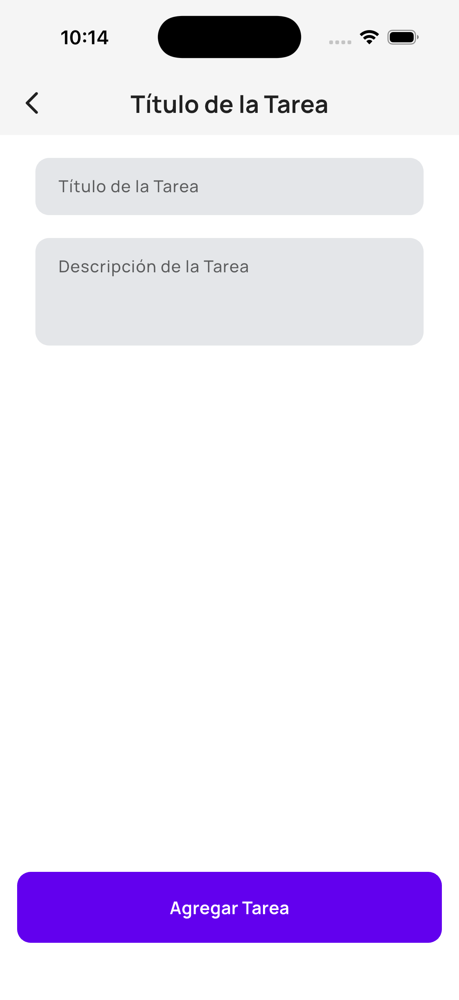
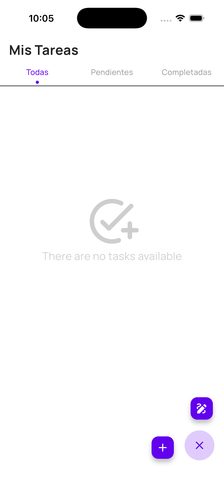
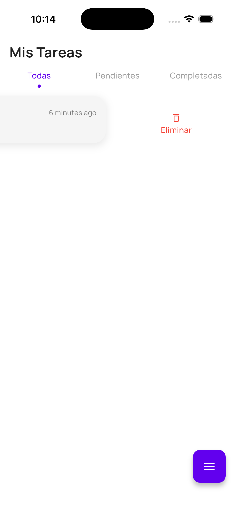
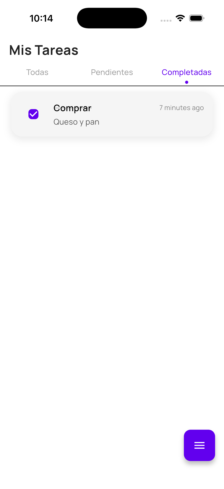
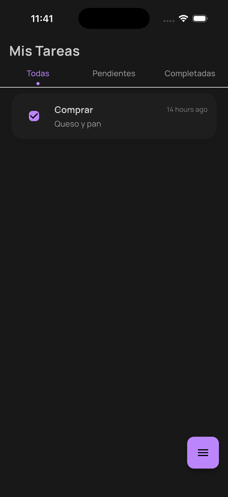
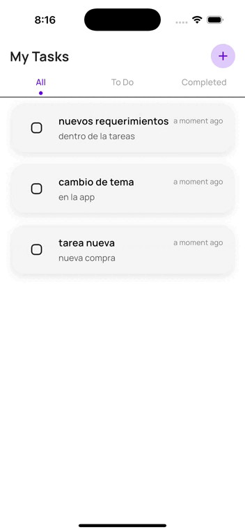

# App Task

Una aplicación de gestión de tareas moderna y eficiente, diseñada para ayudar a los usuarios a organizar su día a día con una interfaz intuitiva y potentes capacidades locales.

## Características Principales

- **Gestión Completa de Tareas:** Crea, edita, organiza y elimina tareas fácilmente.
- **Base de Datos Local con Sembast:** Almacenamiento persistente, rápido y seguro sin necesidad de conexión a internet.
- **Reconocimiento de Texto (OCR):** Capacidad para detectar y procesar texto a partir de imágenes utilizando Google ML Kit.
- **Interfaz Adaptable y Moderna:** Diseño fluido con soporte para **Modo Oscuro** y gestos de **Drag and Drop**.
- **Internacionalización:** Soporte nativo para múltiples idiomas (Español e Inglés).
- **Arquitectura Limpia (Clean Architecture):** Estructura de código escalable, testeable y fácil de mantener.

## Tecnologías Utilizadas

- **Flutter & Dart**
- **Sembast** (NoSQL local database)
- **Freezed & Json Serializable** (Generación de código)
- **Flutter Meedu** (Géstor de estado)
- **Google ML Kit** (Text Recognition)
- **Clean Architecture** (Capa de Dominio, Datos y Presentación)

# Getting Started

## Prerequisites

- [Flutter](https://docs.flutter.dev/get-started/install) (>= 3.x.x)
- Un emulador o dispositivo físico (iOS o Android)
- [VSCode](https://code.visualstudio.com/) o [Android Studio](https://developer.android.com/studio)

## Project Setup

```bash
$ flutter pub get
$ dart run build_runner build -d --delete-conflicting-outputs
$ flutter run
```

## Gen-l10n
```bash
$ flutter gen-l10n
```

## Test

```bash
$ flutter test
```

# App Images

<div style="display: flex; flex-wrap: wrap; gap: 10px;">

  
  
  
  
  
  

</div>

## Dark Mode

<div style="display: flex; flex-wrap: wrap; gap: 10px;">

  

</div>

## Drag and Drop

<div style="display: flex; flex-wrap: wrap; gap: 10px;">

  

</div>

# Folders Structure

```
lib/                            # Código fuente principal de la aplicación Flutter
└── app/                        # Carpeta principal de la aplicación
    ├── core/                   # Configuraciones y utilidades centrales
    │   ├── adaptative_screen/  # Manejo de diseño adaptativo para diferentes tamaños de pantalla
    │   ├── injects_providers/  # Inyecciones de dependencias (db, storage, loggers, etc.)
    │   ├── instances/          # Instancias compartidas (como SecureStorage o SharedPreferences)
    │   ├── l10n/               # Configuración de localización e internacionalización
    │   └── utils/              # Funciones y helpers reutilizables (incluyendo temas)
    │
    ├── data/                   # Fuente de datos externa o local
    │   ├── repositories_impl/  # Implementaciones concretas de los repositorios definidos en domain
    │   └── source/providers/   # Proveedores de datos (API REST, Sembast, etc.)
    │
    ├── domain/                 # Lógica de negocio y definiciones del dominio
    │   ├── defs/               # Definiciones, constantes o tipos
    │   ├── models/             # Modelos del dominio (task, auth, preferences, supabase)
    │   ├── repositories/       # Contratos (interfaces) de repositorios
    │   ├── responses/          # Modelos de respuesta y envoltorios de datos
    │   └── uses_cases/         # Casos de uso (tasks, snackbar, timeago, user_preferences, etc.)
    │
    ├── presentation/           # Capa visual y lógica de UI
    │   ├── global/             # Recursos globales reutilizables
    │   │   ├── controllers/    # Controladores generales
    │   │   ├── extensions/     # Extensiones de Dart (DateTime, String, etc.)
    │   │   ├── l10n_gen/       # Generación de código para localización
    │   │   ├── router/         # Navegación general y configuración de rutas
    │   │   ├── utils/          # Utilidades específicas de presentación
    │   │   ├── validators/     # Validadores de formularios y lógica de validación
    │   │   └── widgets/        # Widgets reutilizables en múltiples módulos
    │   │
    │   ├── modules/            # Módulos de pantalla divididos por funcionalidad
    │   │   ├── auth/           # UI y lógica para autenticación
    │   │   ├── new_task/       # UI y lógica para crear una nueva tarea
    │   │   ├── splash/         # Pantalla de carga inicial (splash screen)
    │   │   ├── task/           # Módulo principal para el manejo de tareas
    │   │   └── task_writing/   # UI y lógica para escritura y reconocimiento de tareas
    │   │
    │   └── router/             # Configuración avanzada del enrutamiento
    │       ├── app_routes/     # Definición de rutas por módulos
    │       └── transitions/    # Transiciones animadas personalizadas
    │
    ├── my_app.dart             # Widget raíz de la aplicación (MaterialApp, temas, etc.)
    ├── inject_repository.dart  # Inyección de dependencias para los repositorios
    └── main.dart               # Punto de entrada principal de la aplicación
test/                           # Código fuente para las pruebas unitarias
└── app/                        # Pruebas relacionadas con la lógica de la aplicación
    └── uses_cases/             # Pruebas para los casos de uso (use cases)
        ├── google_text_recognition/ # Pruebas de reconocimiento de texto
        ├── snackbar/           # Pruebas de notificaciones (snackbar)
        ├── tasks/              # Pruebas específicas de tareas
        ├── timeago/            # Pruebas de formato de tiempo
        └── user_preferences/   # Pruebas de preferencias de usuario
```

## Descripción de las Capas

### 🏛️ Core
Esta capa contiene la base técnica de la aplicación. Aquí se gestionan las configuraciones globales, utilidades transversales (como temas y adaptabilidad de pantalla) y la inicialización de servicios externos (bases de datos locales, almacenamiento seguro, etc.).

### 💾 Data
Responsable de la persistencia y la comunicación externa.
- **Providers:** Implementan el acceso directo a fuentes de datos (Sembast para base de datos local, APIs).
- **Repositories Impl:** Conectan la capa de datos con la de dominio, implementando las interfaces definidas por el negocio.

### 🧠 Domain
El corazón de la aplicación, independiente de cualquier framework o librería externa.
- **Models:** Entidades puras de datos.
- **Repositories:** Contratos que definen qué datos necesita el negocio.
- **Use Cases:** Encapsulan la lógica de negocio pura (ej. "crear una tarea", "clasificar tareas").

### 🎨 Presentation
Gestiona todo lo relacionado con la interfaz de usuario y la experiencia del usuario.
- **Modules:** Cada funcionalidad tiene su propio módulo con su vista y su lógica de estado (controladores).
- **Global:** Widgets y utilidades que se comparten en toda la aplicación (botones personalizados, extensiones, validadores).
- **Router:** Manejo centralizado de la navegación y las transiciones entre pantallas.

---

