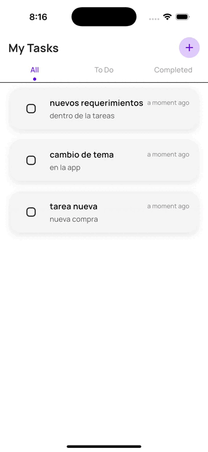

# App Task

A new Flutter project with sembast as database.

# Getting Started

## Prerequisites

- [Flutter](https://docs.flutter.dev/get-started/install) (>= 3.x.x)
- Un emulador o dispositivo físico (iOS o Android)
- [VSCode](https://code.visualstudio.com/) o [Android Studio](https://developer.android.com/studio)

## Project Setup

```bash
$ flutter pub get
$ dart run build_runner build -d --delete-conflicting-outputs
$ flutter run
```

## Test

```bash
$ flutter test
```

# App Images

<div style="display: flex; flex-wrap: wrap; gap: 10px;">

  
  
  
  
  
  

</div>

## Dark Mode

<div style="display: flex; flex-wrap: wrap; gap: 10px;">

  

</div>

## Drag and Drop

<div style="display: flex; flex-wrap: wrap; gap: 10px;">

  

</div>

# Folders Structure

```
lib/                            # Código fuente principal de la aplicación Flutter
└── app/                        # Carpeta principal de la aplicación
    ├── core/                   # Configuraciones y utilidades centrales
    │   ├── adaptative_screen/  # Manejo de diseño adaptativo para diferentes tamaños de pantalla
    │   ├── http/               # Configuración del cliente HTTP (Dio, interceptores, etc.)
    │   ├── injects_providers/  # Inyecciones de dependencias generales
    │   ├── instances/          # Instancias compartidas (como Dio o SharedPreferences)
    │   └── utils/              # Funciones y helpers reutilizables
    │
    ├── data/                   # Fuente de datos externa o local
    │   ├── repositories_impl/  # Implementaciones concretas de los repositorios definidos en domain
    │   └── source/providers/   # Proveedores de datos (API REST, base de datos, etc.)
    │
    ├── domain/                 # Lógica de negocio y definiciones del dominio
    │   ├── defs/               # Definiciones, constantes o tipos
    │   ├── models/task/        # Modelos del dominio relacionados a tareas
    │   ├── repositories/       # Contratos (interfaces) de repositorios
    │   └── uses_cases/         # Casos de uso que encapsulan acciones específicas del negocio
    │
    ├── presentation/           # Capa visual y lógica de UI
    │   ├── global/             # Recursos globales reutilizables
    │   │   ├── controllers/    # Controladores generales
    │   │   ├── extensions/     # Extensiones de Dart (DateTime, String, etc.)
    │   │   ├── router/         # Navegación general (puede ser GoRouter, AutoRoute, etc.)
    │   │   ├── utils/          # Utilidades específicas de presentación
    │   │   └── widgets/        # Widgets reutilizables en múltiples módulos
    │   │
    │   └── modules/            # Módulos de pantalla divididos por funcionalidad
    │       ├── new_task/       # UI y lógica para crear una nueva tarea
    │       ├── splash/         # Pantalla de carga inicial (splash screen)
    │       └── task/           # Módulo principal para el manejo de tareas
    │
    ├── router/                 # Configuración avanzada del enrutamiento
    │   ├── app_routes/         # Rutas por módulo o características
    │   ├── transitions/        # Transiciones animadas personalizadas entre pantallas
    │   └── router_provider.dart # Provider principal para el sistema de rutas
    │
    ├── my_app.dart             # Widget raíz de la aplicación (MaterialApp, temas, etc.)
    ├── inject_repository.dart  # Inyección de dependencias para los repositorios
    └── main.dart               # Punto de entrada principal de la aplicación
test/                           # Código fuente para las pruebas unitarias
└── app/                        # Pruebas relacionadas con la lógica de la aplicación
    ├── uses_cases/             # Pruebas para los casos de uso (use cases)
    │   ├── tasks/              # Pruebas específicas de los casos de uso relacionados con tareas
```
